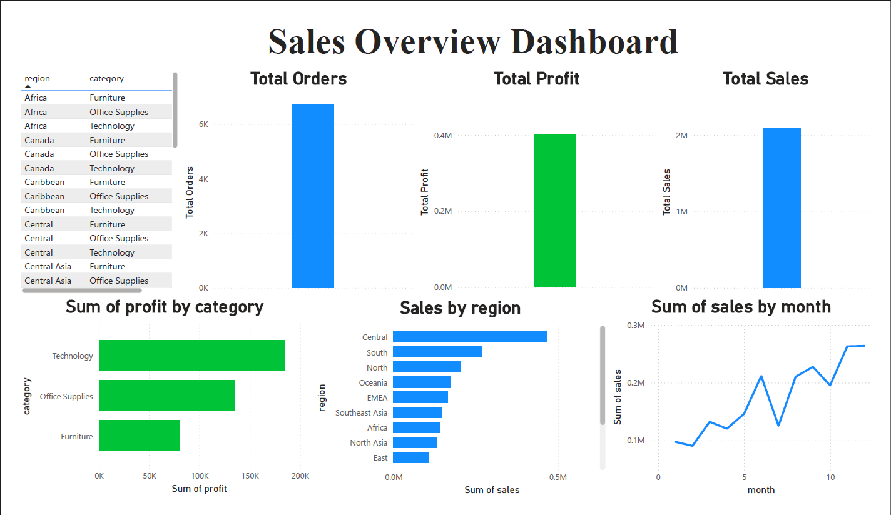

# 📊 Sales Analytics & Business Insights Dashboard

🚀 Built an end-to-end data analytics project analyzing 13,000+ sales records to uncover key business trends, optimize profitability, and support data-driven decision-making.


## 🚀 Project Overview

This project presents a complete end-to-end data analytics solution built to analyze retail sales data and extract actionable business insights. It covers the entire workflow from data preprocessing and exploratory analysis to visualization and basic predictive modeling.

The goal of this project is to demonstrate how raw data can be transformed into meaningful insights that support data-driven decision-making.

---

## 🎯 Objective

* Analyze retail sales data to identify key business trends
* Understand factors affecting sales and profitability
* Build interactive visualizations for better decision-making
* Apply basic machine learning to explore predictive capabilities

---
## 💼 Business Impact

This project demonstrates how data analysis can help businesses:

- Identify profitable regions and products  
- Optimize pricing and discount strategies  
- Understand seasonal sales patterns  
- Improve decision-making using data insights

---

## 🛠️ Tools & Technologies

* **Python** (Pandas, NumPy) → Data Cleaning & Processing
* **Matplotlib & Seaborn** → Data Visualization
* **Power BI** → Interactive Dashboard
* **Scikit-learn** → Machine Learning (Linear Regression)

---
## 🚀 Key Highlights

- Analyzed 13,000+ real-world sales transactions  
- Identified high-performing regions and profit-driving categories  
- Discovered negative impact of discounts on profitability  
- Built interactive Power BI dashboard for business insights  
- Applied machine learning to explore sales prediction
  
---

## 📂 Project Structure

```
sales-analytics-project/
│
├── notebook/
│   └── sales_analysis.ipynb
│
├── data/
│   └── cleaned_sales_data.csv
│
├── dashboard/
│   ├── sales_dashboard.pbix
│   └── dashboard.png
│
└── README.md
```

---

## 🔄 Project Workflow

### 1️⃣ Data Cleaning & Preprocessing

* Handled missing values using appropriate techniques
* Converted date columns to proper datetime format
* Removed duplicate records
* Ensured correct data types for analysis

---

### 2️⃣ Exploratory Data Analysis (EDA)

* Analyzed overall sales, profit, and order distribution
* Performed region-wise and category-wise analysis
* Identified top-performing and underperforming segments
* Visualized trends using graphs and charts

---

### 3️⃣ Outlier Analysis

* Used boxplots to detect outliers in sales and profit
* Identified extreme values including high sales and negative profit
* Retained outliers as they represent real-world scenarios such as:

  * Bulk purchases
  * Loss-making transactions due to discounts

---

### 4️⃣ Key Business Insights

* Central region contributes the highest sales
* Technology category generates maximum profit
* Furniture category shows relatively lower profitability
* High discounts negatively impact profit margins
* Sales show a strong increasing trend towards the end of the year
* Some sub-categories (e.g., Tables) lead to losses

---

### 5️⃣ Machine Learning (Optional Analysis)

* Built a **Linear Regression model** to predict sales
* Achieved an R² score of approximately **0.27 (moderate performance)**
* Found that sales are influenced by multiple factors beyond basic features

📌 Insight:

> Sales prediction requires more complex features such as customer behavior, product demand, and seasonal patterns.

---

## 📊 Power BI Dashboard

The dashboard provides a visual overview of key business metrics:

### 🔹 Key Features

* Total Sales, Profit, and Orders KPIs
* Sales distribution across regions
* Profit comparison by category
* Monthly sales trend analysis
* Interactive filters for dynamic exploration

---

## 📸 Dashboard Preview



---
## 📊 Interactive Dashboard

The Power BI dashboard provides a comprehensive view of business performance:

- 📈 Total Sales, Profit, and Orders (KPIs)
- 🌍 Regional sales distribution
- 📦 Category-wise profit analysis
- 📅 Monthly sales trends
- 🎛️ Interactive filters for dynamic exploration
  
---

## 💡 Conclusion

This project demonstrates the practical application of data analytics techniques to uncover business insights and support strategic decisions. It highlights the importance of data preprocessing, visualization, and analytical thinking in solving real-world problems.

---

## 🔗 Author

**Praveen K N**
Aspiring Data Analyst | AI & ML Enthusiast

---

⭐ If you found this project useful, feel free to connect or reach out!
